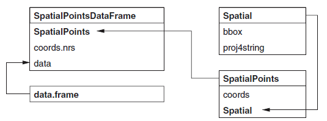

<div style="margin-bottom:50px;">
```{r setup, include=FALSE}
knitr::opts_chunk$set(echo = TRUE)
```
</div>


# Goal


* In this lab, you will learn 
  + Creat different type of spatial objects
  + Some basic property and manipulation of these spatial objects


# SpatialPointsDataFrame Class 


*Information of spatial class can be found in class notes: Chpater 1--Visualisation.*

The diagram will help
```{r, echo=FALSE, fig.width=8, fig.align="center"}
setwd("C:/Users/tingjinc/OneDrive - The University of Melbourne/Documents/GitFile/90122Lab")
#setwd("~/Dropbox/1_MAST90122/2_Spatial_Lab/1_Visualisation_Lab23679/1_sp")
#setwd("~/Dropbox/1-MAST90122/2_Spatial_Lab/1_Visualisation_Lab2367/1_sp")
#setwd("/home/unimelb.edu.au/tingjinc/Dropbox/1_MAST90122/Spatial_Lab/2_Chapter1")

```

## Create Spatial Class
* For Spatial class, we will need two components
  + bbox: it is the domain of spatial objects. In the following example, the domain is $[0,1]\times [0,1]$.
  + CRS: coordinate reference sytem (See Cp1-4 for more details). In the following example, the CRS is WGS84. 
```{r, echo=TRUE, fig.width=8, fig.align="center"}
library(sp)
m=matrix(c(0,0,1,1),ncol=2, dimnames=list(NULL, c("min","max")))  
crs=CRS(projargs="+proj=longlat +ellps=WGS84")    
S=Spatial(bbox=m, proj4string=crs)
```
At this stage, nothing is plotted yet. Next, we will add points through SpatialPoints class

## Create SpatialPoints Class
Recall SpatialPoints = Spatial + coords. We would like to add 4 points:  $(1,1), (2,2), (3,3), (4,4)$. It can achieved through *coords = loccords*, where *loccords* is a matrix containing locations (you can use other names if you want.)
```{r, echo=TRUE, fig.width=3, fig.height =3, fig.align="center"}
lcoords=matrix(rep(1:4,each=2),ncol=2,byrow=T)    ## coords
SP=SpatialPoints(coords = lcoords,bbox = m, proj4string = crs)

## Access the elements
bbox(SP)
proj4string(SP)
SP@coords
SP@bbox
SP@proj4string
```

```{r, echo=TRUE, fig.align="center"}
## plot
plot(SP)
```

* Question: There are supposed to be four points.
  + Why are you only seeing one?
  + Do you know how to fix it (hint: adjust bbox)

## Create SpatialPointsDataFrame Class
Recall SpatialPointsDataFrame = SpatialPoints + data.frame

Imagine we would like to add attribute to SpatialPoints. The way to achive this is through data.frame. For example, we would like to assign attribute $Z(s_1)=1.1$, $Z(s_2)=1.2$, $Z(s_3)=1.6$ and $Z(s_4)=2.1$. 

The argument *coords.nrs* is optional, and will not be used in this subject. 
```{r, echo=TRUE, fig.width=3, fig.height =3, fig.align="center"}
names=c("a","b","c","d")
df = data.frame(z=c(1.1,1.2,1.6,2.1), row.names=names)
m = matrix(c(0,0,5,5),ncol=2, dimnames=list(NULL, c("min","max")))  
SP@bbox = m
SPDF = SpatialPointsDataFrame(SP,data=df)

## Access the elements
SPDF@data

## Plot: location with value
## Note here that you need to write "z" which is the same name you defined in df. 
spplot(SPDF,zcol="z")


## Another way to create SpatialPointsDataFrame (directly from a data.frame)
SPDF2 = data.frame(name = names, x = lcoords[,1], y = lcoords[,2], value = df )
coordinates(SPDF2) = ~x+y
class(SPDF2)
proj4string(SPDF2) <- CRS("+proj=longlat +datum=WGS84")    ## Add CRS
```


# SpatialPolygonsDataFrame

Due to time constrain, I will not talk about spatiallines class. Instead, I will focus on SpatialPolygonsDataFrame. 

First, the diagram
```{r, echo=FALSE, fig.width=8, fig.align="center"}
#setwd("~/Dropbox/1-MAST90122/Spatial Lab/2-Chapter1")
#setwd("/home/unimelb.edu.au/tingjinc/Dropbox/1_MAST90122/Spatial_Lab/2_Chapter1")
knitr::include_graphics("pics/SpPnDF.png")
```

## Create Polygon

Here, we will create Polygon class. For example, *Sr1* has the vertices $(2,2)$, $(4,3)$, $(4,5)$ and $(1,4)$. However, $(2,2)$ needs to be write twice, since it is both the starting vertex and ending vertex. 
```{r, echo=TRUE, fig.width=8, fig.align="center"}
#getClass("Polygon")
Sr1 = Polygon(cbind(c(2,4,4,1,2),c(2,3,5,4,2)))
Sr2 = Polygon(cbind(c(5,4,2,5),c(2,3,2,2)))
Sr3 = Polygon(cbind(c(4,4,5,10,4),c(5,3,2,5,5)))
Sr4 = Polygon(cbind(c(5,6,6,5,5),c(4,4,3,3,4)), hole = TRUE)
```


## Create Polygons
Note the difference between the previous subsection: Polygon vs Polygons. A Polygons can contain any number of Polygon (including only 1 Polygon). 

Why do we need polygons? Imagine you want to draw a country, which has more than 1 island (e.g. New Zealand). 
```{r, echo=TRUE, fig.width=8, fig.align="center"}
#getClass("Polygons")
Srs1 = Polygons(list(Sr1), "s1")
Srs2 = Polygons(list(Sr2), "s2")
Srs3 = Polygons(list(Sr3, Sr4), "s3/4")
```

## Create SpatialPolygons
```{r, echo=TRUE, fig.width=6, fig.align="center"}
#getClass("SpatialPolygons")
SpP = SpatialPolygons(list(Srs1,Srs2,Srs3), 1:3)
plot(SpP, col = 1:3, bg="yellow")
```
Note that there is a hole in one of Polygons

## Create SpatialPolygonsDataFrame
```{r, echo=TRUE, fig.width=6, fig.align="center"}
#getClass("SpatialPolygons")
df = data.frame(z1 = c(1.2,1.3,1.6), z2 = c(2.2,2.8,3.9), row.names = row.names(SpP))
SpPDF = SpatialPolygonsDataFrame(Sr = SpP, data = df)
spplot(SpPDF, zcol = "z1")
```
The argument "row.names = row.names(SpP)" is needed.  


# Review: Key Functions
* Create spatial objects
  + Spatial
  + SpatialPoints, SpatialPointsDataFrame
  + SpatialPolygons, SpatialPolygonsDataFrame
* Visualization
  + spplot


# Further Study

Study vector data manipulation(https://rspatial.org/raster/spatial/7-vectmanip.html). Here, vector data is referring to SpatialPolygonsDataFrame. 


# References
* For more information, please see (Not required to read, and treat the following materials as reference. )
  + Classes and Methods for Spatial Data: the sp Package (https://cran.r-project.org/web/packages/sp/vignettes/intro_sp.pdf)
  + Introduction to visualising spatial data in R
(https://cran.r-project.org/doc/contrib/intro-spatial-rl.pdf)
  + Spatial data manipulation
(https://rspatial.org/raster/spatial/index.html)

