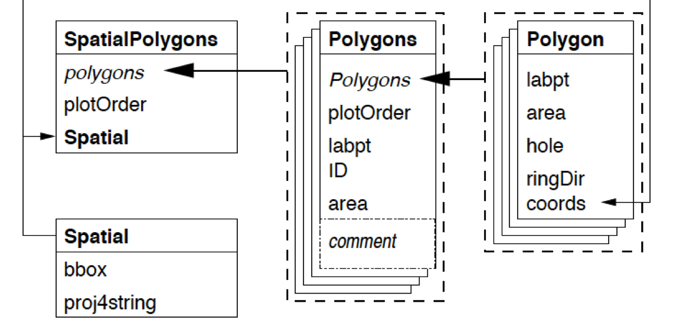

<div style="margin-bottom:50px;">
```{r setup, include=FALSE}
knitr::opts_chunk$set(echo = TRUE)
```

</div>


# SpatialPolygonsDataFrame

* There are two ways to represent spatial shapes
  + ggplot2 + sf: our preference
  + sp class: SpatialPoints(DataFrame), SpatialLines(DataFrame), SpatialPolygons(DataFrame). Although it is not our focus, we have to know some basics since some R packages depend on sp class. 


Due to time constrain, I will only include *SpatialPolygonsDataFrame* here. More details about sp class can be found in Extra 2. 

First, the diagram
```{r, echo=FALSE, fig.width=8, fig.align="center"}
#setwd("~/Dropbox/1-MAST90122/Spatial Lab/2-Chapter1")
#setwd("/home/unimelb.edu.au/tingjinc/Dropbox/1_MAST90122/Spatial_Lab/2_Chapter1")

```

## Create Polygon

Here, we will create Polygon class. For example, *Sr1* has the vertices $(2,2)$, $(4,3)$, $(4,5)$ and $(1,4)$. Note that $(2,2)$ needs to be written twice, since it is both the starting vertex and the ending vertex. 
```{r, echo=TRUE, fig.width=8, fig.align="center"}
library(sp)
#getClass("Polygon")
Sr1 = Polygon(cbind(c(2,4,4,1,2),c(2,3,5,4,2)))
Sr2 = Polygon(cbind(c(5,4,2,5),c(2,3,2,2)))
Sr3 = Polygon(cbind(c(4,4,5,10,4),c(5,3,2,5,5)))
Sr4 = Polygon(cbind(c(5,6,6,5,5),c(4,4,3,3,4)), hole = TRUE)
```


## Create Polygons
A Polygons can contain any number of Polygon (including only 1 Polygon). 

Why do we need polygons? Imagine you want to draw world map. Each Polygons can represent a country, while a Polygon cannot. For example, New Zealand comprises two major islands, and you need two polygons, which is a Polygons. 
```{r, echo=TRUE, fig.width=8, fig.align="center"}
#getClass("Polygons")
Srs1 = Polygons(list(Sr1), "s1")
Srs2 = Polygons(list(Sr2), "s2")
Srs3 = Polygons(list(Sr3, Sr4), "s3/4")
```

## Create SpatialPolygons
```{r, echo=TRUE, fig.width=6, fig.align="center"}
#getClass("SpatialPolygons")
SpP = SpatialPolygons(list(Srs1,Srs2,Srs3), 1:3)
plot(SpP, col = 1:3, bg="yellow")
```
Note that there is a hole in one of Polygons

## Create SpatialPolygonsDataFrame
```{r, echo=TRUE, fig.width=6, fig.align="center"}
#getClass("SpatialPolygons")
df = data.frame(z1 = c(1.2,1.3,1.6), z2 = c(2.2,2.8,3.9), row.names = row.names(SpP))
SpPDF = SpatialPolygonsDataFrame(Sr = SpP, data = df)
spplot(SpPDF, zcol = "z1")
```
The argument "row.names = row.names(SpP)" is needed.  


# Moran's I
## Create Weight Matrix

The dataset is *gmel2*, and it can be downloaded at https://github.com/TedChu/90122Lab/tree/master/datasets.
```{r, echo=TRUE, fig.width=10, fig.align="center", message = FALSE}
library(spdep)
load("datasets/gmel2.Rdata")
```


R function *poly2nb* produces a spatial weight matrix from a SpatialPolygons(DataFrame) object. 
```{r, echo=TRUE, fig.width=6, fig.height =6, fig.align="center"}
## Convert gmel2 to SpatialPolygonsDataFrame, since the following packages require SpatialPolygonsDataFrame
gmel.sp = as(gmel2, "Spatial")
Wqueen = poly2nb(gmel.sp)
Wrook = poly2nb(gmel.sp, queen=FALSE)
plot(gmel.sp,border="grey60", axes=TRUE)
plot(Wqueen, coordinates(gmel.sp), pch=19, cex=0.6, add=TRUE,col="red")
plot(Wrook, coordinates(gmel.sp), pch=19, cex=0.6, add=TRUE)
```

* There are three potential class for spatial weight matrix: *nb* (neighborhood) class, *mat* (matrix) class, and *listw* class.
  + They all store the same information, but in different formats.
  + Different functions may require different formats. For example, *moran.test* requires the  *listw* class. You can find these information in help files of these functions.
  + Functions to transform between these three formats: *nb2listw*, *nb2mat*, *mat2nb*, etc. 


Can you see the difference between *queen* rule and *rook* rule?


## Moran's I test
A Moran's I test is performed on the variable *price*. More information about Moran's I codes can be found in Cp1C -- 8. 


```{r, echo=TRUE, fig.align="center"}
## plot
moran.test(x=gmel2$price, nb2listw(Wqueen), alternative="two.sided")
```

Since the p-value < 0.05, we conclude that there is spatial autocorrelation for the house price in Greater Melbourne.  


* Comments
  + The function requires *listw* form for spatial weight matrix
  + Argument *alternative*
    + What will you do if the alternative test is "There is positive spatial autocorrelation".
  + The above test is *Moran I test under randomisation*. 
    + What does this mean?
    + If you want to take analytical approach mentioned in lectures, what should you do?
    
    
## LISA

LISA is performed on *price* variable. 
```{r, echo=TRUE, fig.width=3, fig.height =3, fig.align="center"}
resI = localmoran(gmel2$price, nb2listw(Wqueen), alternative="two.sided")
round(head(resI),3)
```
* For the lisa output
  + First column: the value of local moran's I
  + Second column: the expected value calculated using numerical approach. Therefore, the results is different from the theoretical result from the lecture (which is $-1/(n-1)$). 
  + Third column: the variance of local moran's I
  + Fourth column $=\frac{(Ii - E.Ii)}{\sqrt{Var.Ii}}$
  + Fifth column: the p-value. 

&nbsp;

Next, some visualisation for the above results. 
```{r, echo=TRUE, fig.width= 6, fig.height = 6, fig.align="center",warning = F}
####
gmellisa = gmel2
gmellisa$lisa = resI[,1]
gmellisa$pvalue = resI[,5]
### Spatial plots with LISA value
library(ggplot2)
ggplot() + geom_sf(data=gmellisa, aes(fill = lisa))

ggplot() + geom_sf(data=gmellisa, aes(fill = pvalue))
```

Suppose we want to know which LGAs have significant local spatial autocorrelation ($\alpha = 0.05$). 

```{r, echo=TRUE, fig.width=3, fig.height =3, fig.align="center",warning = F}
gmellisa$name2[gmellisa$pvalue < 0.05]
```

They all have positive LISA values. If you want to formally test whether there are positive local autocorrelation, you will need to change *alternative* to *greater*.

You can also highlight these cities. 

```{r, echo=TRUE, fig.width=8, fig.height =8, fig.align="center",warning = F}
gmellisa2 = gmellisa[gmellisa$pvalue < 0.05, ]
ggplot() + geom_sf(data=gmellisa, aes(fill = pvalue)) + 
  geom_sf(data = gmellisa2, color = "red", alpha = 0) + 
  geom_sf_label(data = gmellisa2, aes(label = name2))
```

or 
```{r, echo=TRUE, fig.width=8, fig.height =8, fig.align="center",warning = F}
library(mapview)
mapview(gmellisa, zcol = "pvalue", at = c(0, 0.01, 0.05, 0.1, 1))
```